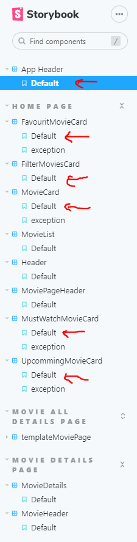
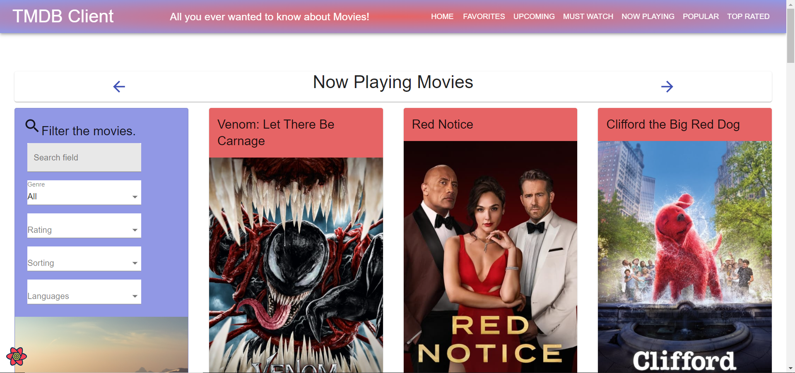
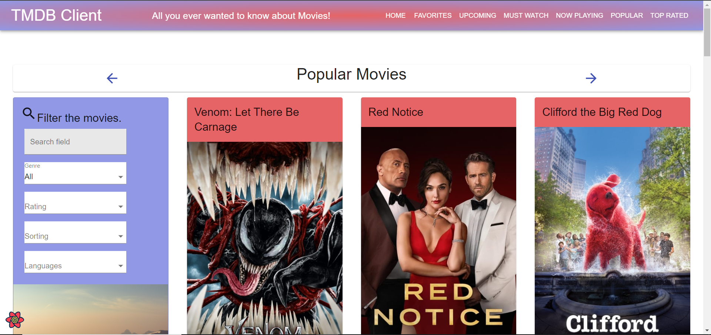
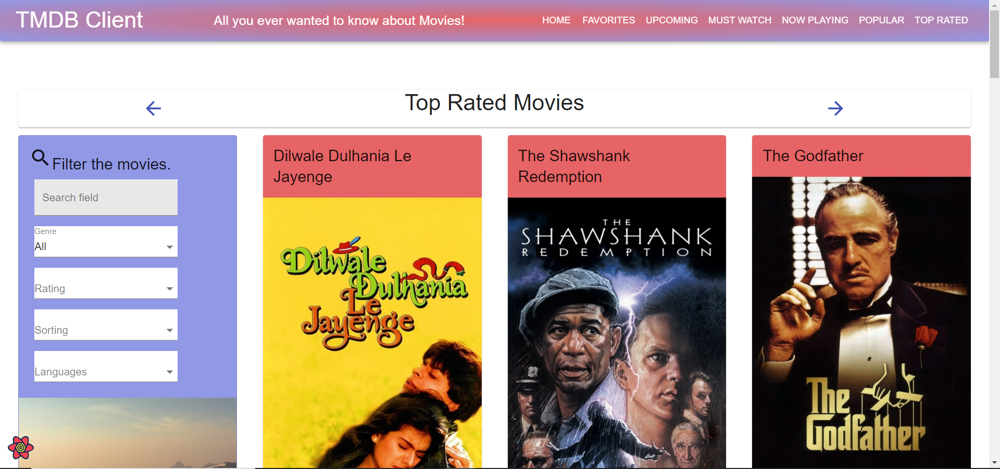
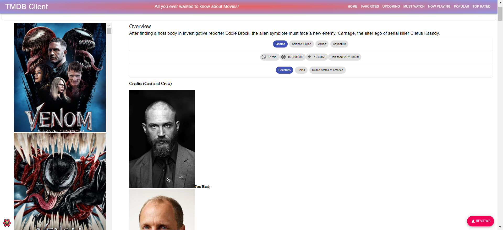
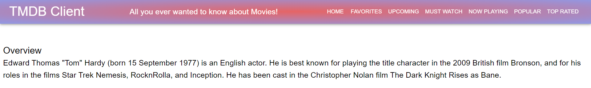
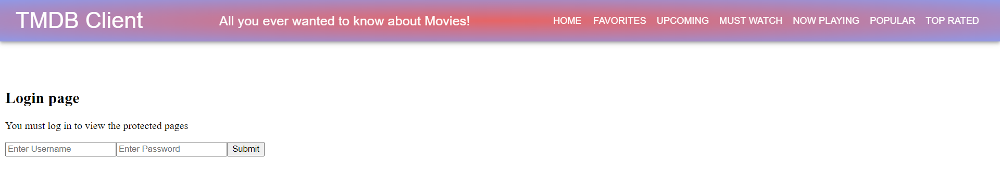

# Assignment 1 - ReactJS app.

Name: [Emran Sabbagh]

### IMPORTANT NOTE.

[While working on the assignment I forgot to regularly commit, therefore when I pushed a commit called "3 new endpoints" it
contained many other features aside from the 3 new endpoints. The rest of the features are normally committed because I added them after making this commit. The features listed in the "3 new endpoints" commit are as follows:]

+ 3 new endpoints
+ 2 new extra endpoints
+ Sorting
+ Filtering
+ More caching
+ Hyperlinking

## Overview.

[This repository contains additional features to the react app we developed in the react labs.]

### Features.
[ A bullet-point list of the __new features__ I added to the Movies Fan app (and any modifications to existing features) .]
 
+ 3 new endpoints
+ 2 new extra endpoints
+ Sorting
+ Filtering
+ More caching
+ Hyperlinking
+ More Storybook support
+ Coloured components
+ Authentication Page

## Setup requirements.

[ No non-standard setup steps necessary to run the app locally.]

## API endpoints.

[ A list of the __additional__ TMDB endpoints used, with the description and pathname for each one.] 

+ Moveis: Get Now Playing - Get a list of movies in theatres - /movie/now_playing
+ Moveis: Get Popular - Get a list of the current popular movies on TMDB - /movie/popular
+ Moveis: Get Top Rated - Get the top rated movies on TMDB - /movie/top_rated
+ Moveis: Get Credits - Get the cast and crew for a movie - /movie/{movie_id}/credits
+ People: Get Details - Get the primary person details by id - /person/{person_id}

## App Design.

### Component catalogue.

[ A screenshot from the Storybook UI that lists all the stories for the app's components, and highlights those relating to my __new/modified components__ .

### UI Design.

[ A screenshots of the __new/modified app pages__ I developed (and modified existing pages), Includes an appropriate caption for each one.

>Home page now contains new functionalities within the filter movie card and new colours for some of its components. Also the pages for the "Now playing", "Popular" and "Top rated" endpoints can be navigated through the app header. These featues are visible in all the pages listed in the app header.

>Now playing movies page for the Now playing endpoint.

>Popular movies page for the Popular endpoint.

>Top rated movies page for the Top rated endpoint.

>Movie details page now shows a list of the movie actors with their names and images.

>When an actor image is clicked in the movie details page, the user will be redirected to a new page where the actor's bio is displayed.

>A login page for the private routes.

### Routing.

[ A list of the __new routes__ supported by my app with the the associated page.]

+ /movie/now_playing -  NowPlayingMoviesPage - displays a list of movies in theatres.
+ /movie/popular -  PopularMoviesPage - displays a list of current popular movies.
+ /movie/top_rated -  TopRatedMoviesPage - displayes the top rated movies.
+ /actor/:id - ActorPage - displayes an actor's bio in a seperate page when the actor image is clicked.

[The FavoriteMoviesPage and the WatchListPage are private routes, the rest are public routes]

